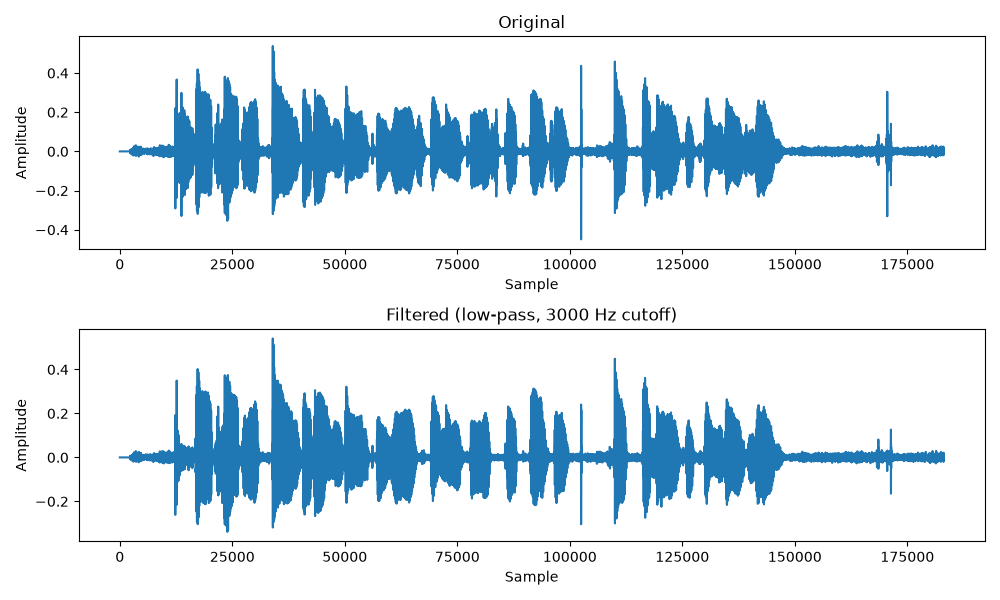
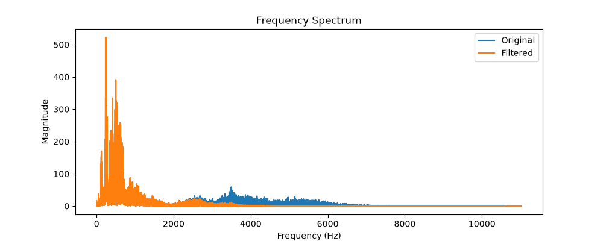

# Audio DSP Filter

A Python project that applies digital signal processing techniques to filter audio, with before/after visualization in both time and frequency domains.

## What it does

- Loads an audio file and converts it into numerical waveform data
- Applies a Butterworth low-pass filter (3000 Hz cutoff) to reduce high-frequency noise
- Visualizes the waveform before and after filtering
- Analyzes the frequency spectrum using FFT to confirm the filter's effect
- Exports the filtered audio as a playable .wav file

## Tech used

- Python
- librosa (audio loading)
- scipy (filter design)
- numpy (FFT/frequency analysis)
- matplotlib (visualization)
- soundfile (audio export)

## Results

**Waveform comparison (before/after filtering):**

**Frequency spectrum (showing the filter's cutoff effect):**

## What I learned

This project deepened my understanding of core DSP concepts — sampling rate, the Nyquist frequency, filter design, and the relationship between time-domain and frequency-domain representations of a signal.
